# Assignment 2
*Name: Abdrakhmanova Aruzhan*
*Group: IT-2501*

## Output Examples

### Part 1

#### task 1
we need to create a class BankAccount with accountNumber, username, balance and store accounts in a LinkedList. i created a separate class BankAccount.java with private fields and getters/setters. `private String accountNumber;` `private String username;` `private double balance;`. i used private because it is good practice to hide internal data and access through methods. in Main.java i declared `static LinkedList<BankAccount> accounts = new LinkedList<>();` to store all accounts dynamically. LinkedList is good here because we dont know how many accounts there will be, unlike array which has fixed size. function addAccount() asks user for account number, username and balance then does `accounts.add(new BankAccount(number, name, balance));` which adds the new account to the end of the list. displayAllAccounts() uses a for-each loop `for (BankAccount acc : accounts)` to go through all accounts and print them one by one. searchByUsername() also loops through all accounts but uses `acc.getUsername().equalsIgnoreCase(username)` to find a match. i used equalsIgnoreCase so it works even if user types "ali" instead of "Ali".

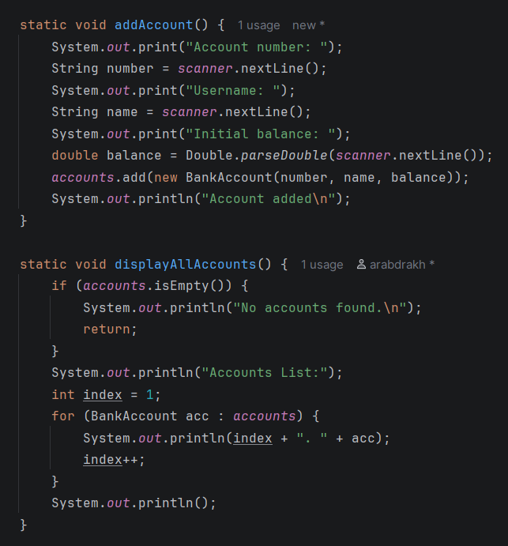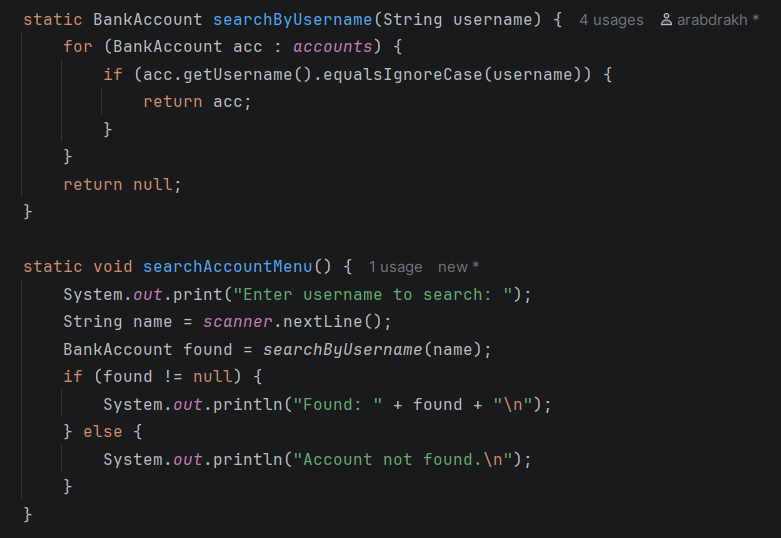
#### task 2
this task extends task 1 to allow deposit and withdraw operations. in deposit() i first search for the account by username using searchByUsername(). if account is not found `if (acc == null)` it prints "Account not found" and returns. if found, it asks for the amount and does `acc.setBalance(acc.getBalance() + amount);` to update the balance directly inside the LinkedList node. no need to remove and re-add, because LinkedList stores references to objects so changing the object changes it everywhere. withdraw() works the same but subtracts and also checks `if (amount <= 0 || amount > acc.getBalance())` to make sure user has enough money and doesnt enter negative numbers. i used Double.parseDouble(scanner.nextLine()) instead of scanner.nextDouble() because nextDouble leaves a newline in the buffer and messes up the next nextLine() call.

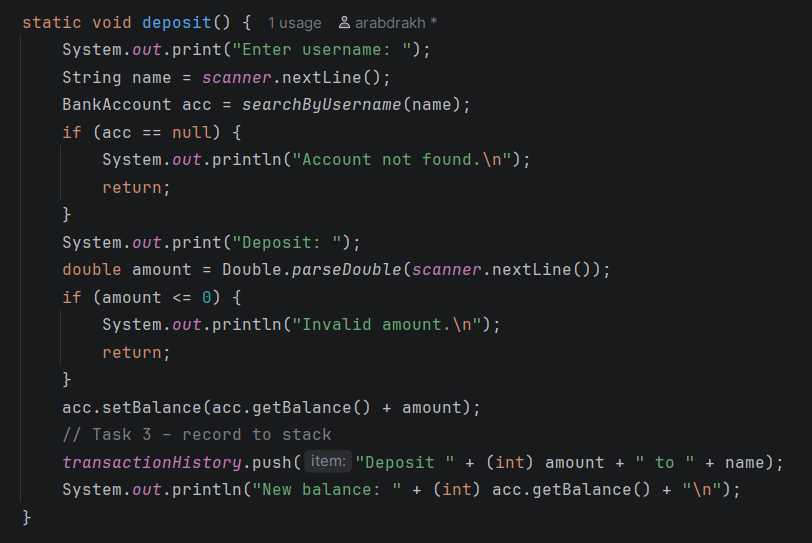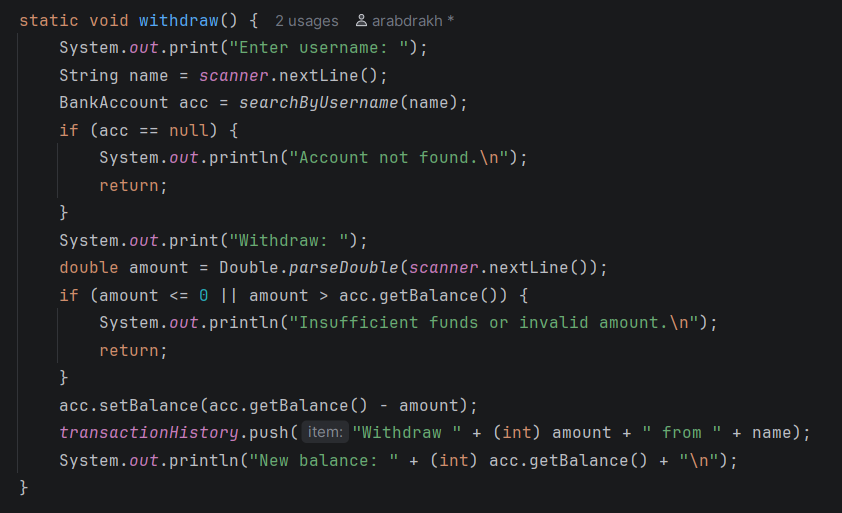

#### task 3
this task adds transaction history using a Stack. i declared `static Stack<String> transactionHistory = new Stack<>();` at the top. Stack is LIFO (last in first out) which makes sense for transaction history because the most recent transaction should be on top. every time deposit or withdraw happens, i push a string to the stack like `transactionHistory.push("Deposit " + (int) amount + " to " + name);`. peekLastTransaction() uses `transactionHistory.peek()` to see the last transaction without removing it. undoLastTransaction() uses `transactionHistory.pop()` which removes and returns the last transaction. showTransactionHistory() prints all transactions from most recent to oldest using `for (int i = transactionHistory.size() - 1; i >= 0; i--)`. i used (int) amount to cast double to int so it prints 50000 instead of 50000.0 which looks cleaner.

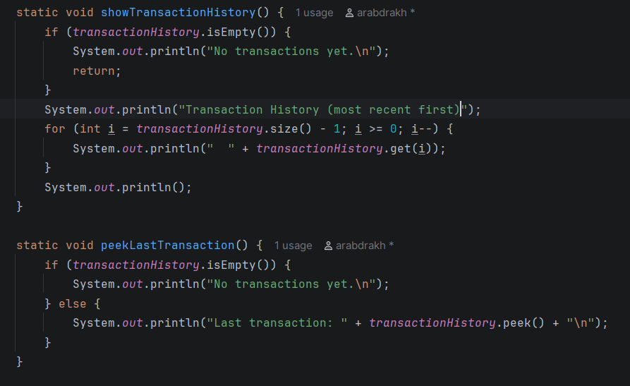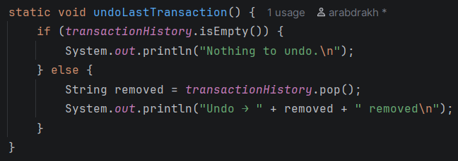

#### task 4
this task creates a bill payment queue using Queue interface. i declared `static Queue<String> billQueue = new LinkedList<>();`. Queue is FIFO (first in first out) which is perfect for bill payments because whoever submits first should be processed first, like a real queue in a bank. addBillPayment() asks for bill name and does `billQueue.add(bill);` to add it to the end of the queue. processNextBill() uses `billQueue.poll()` which removes and returns the first element from the queue. if queue is empty poll() returns null but i check `billQueue.isEmpty()` before calling it. after processing i also push the bill to transactionHistory stack so it appears in the history. i used LinkedList as the implementation of Queue because LinkedList implements the Queue interface in java.

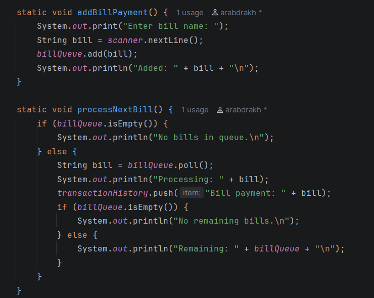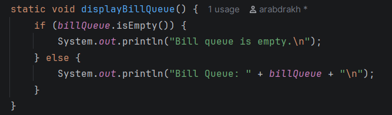

#### task 5
this task simulates account opening requests. user submits a request which goes into `static Queue<String> accountRequests = new LinkedList<>();` and admin processes the queue. submitAccountRequest() takes a name and adds it to the queue with `accountRequests.add(name);`. processAccountRequest() uses `accountRequests.poll()` to get the first request, generates an account number like `"ACC" + (accounts.size() + 1)` and creates a new BankAccount with balance 0 and adds it to the main accounts LinkedList. this simulates a real banking workflow where a client submits an application and the bank employee approves it. displayPendingRequests() just prints the queue so admin can see whats waiting.

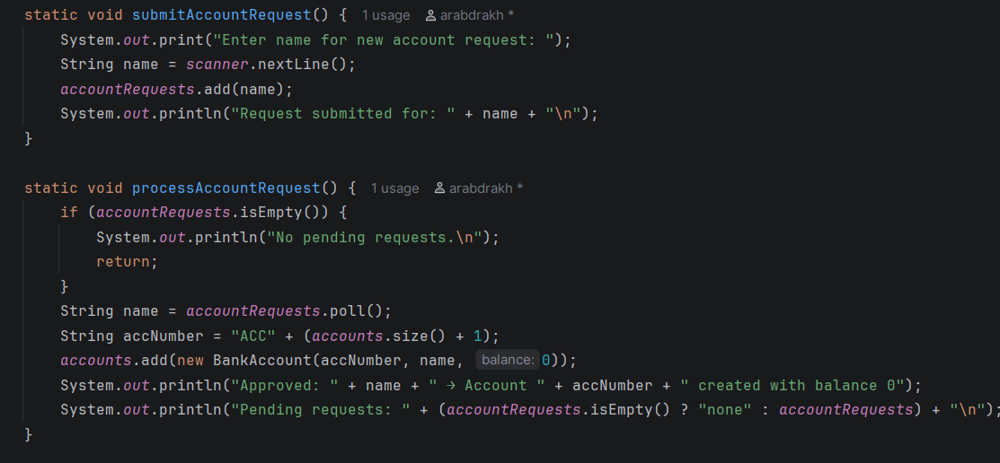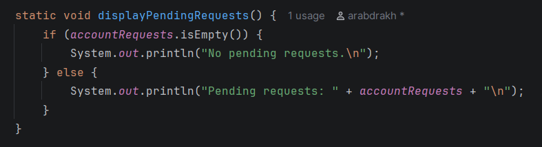

### Part 2

#### task 6
this task demonstrates physical data structure using a fixed-size array. i created `BankAccount[] fixedAccounts = new BankAccount[3];` with exactly 3 elements. then stored 3 predefined accounts: Ali with 150000, Sara with 220000, Omar with 310000. the difference from LinkedList is that array has fixed size allocated in memory at creation time. you cannot add a 4th element to BankAccount[3], you would need to create a new bigger array. LinkedList on the other hand can grow and shrink dynamically because each node just points to the next one in memory. this is the main difference between physical (array - fixed, contiguous memory) and logical (LinkedList - dynamic, nodes linked by references) data structures.

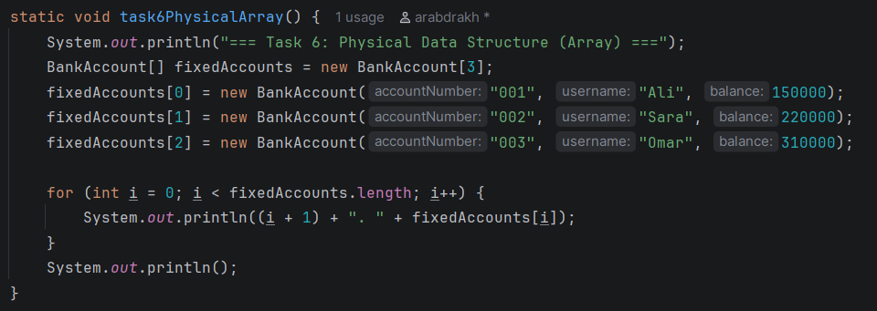

### Part 3 – Mini Banking Menu

this part integrates all tasks together into one menu-driven program. in main() i first call task6PhysicalArray() to demonstrate the array, then preload 2 sample accounts (Ali and Sara) so the user can immediately test deposit/withdraw without creating accounts first. the main menu has 4 options: 1 – Enter Bank, 2 – Enter ATM, 3 – Admin Area, 4 – Exit. i used a while(true) loop with switch-case for the menu. each sub-menu also has its own while(true) loop so the user stays in the sub-menu until they choose 0 to go back. i read input as String with scanner.nextLine() and compare with switch(choice) case "1" etc., this way if user types something random like "abc" it just falls to default case and prints "Invalid option" instead of crashing.

Bank Menu has: submit account request (goes to queue), deposit, withdraw, display all accounts, search account, transaction history, add bill payment. it uses LinkedList for accounts and Stack for history.

ATM Menu has: balance enquiry and withdraw. balance enquiry asks for username, finds the account with searchByUsername() and prints the balance. withdraw reuses the same withdraw() function from task 2.

Admin Menu has: view pending account requests, process next request, view bill queue, process next bill, undo last transaction. this is where queue processing happens.

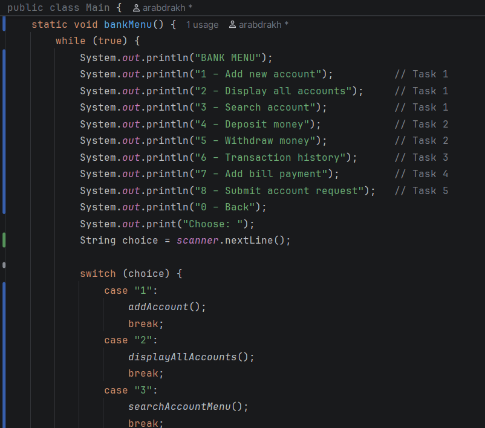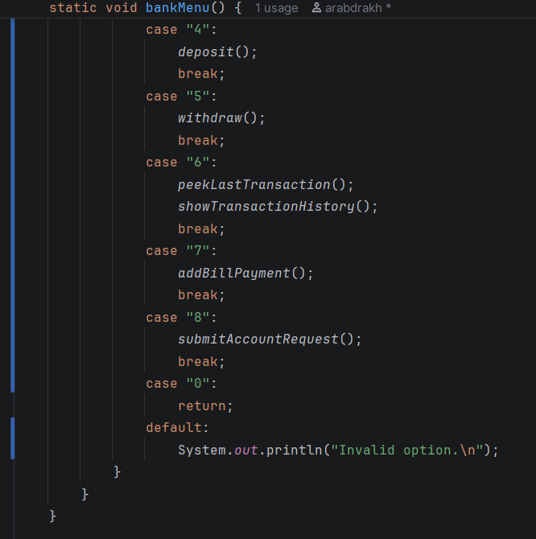

## Summary
in this assignment i practiced working with different data structures in java:

- LinkedList for dynamic account storage where we can add/remove accounts without worrying about size
- Stack (LIFO) for transaction history where the last action is always on top and can be undone
- Queue (FIFO) for bill payments and account requests where first come first served
- Array for fixed-size physical storage to understand the difference with dynamic structures

the most challenging part for me was understanding how Queue and LinkedList work together, because in java LinkedList implements the Queue interface so the same class can behave as both a list and a queue depending on which methods you use. also integrating everything into one menu system with multiple sub-menus took some time to organize properly. i used knowledge from previous assignments and oop concepts like encapsulation (private fields, getters/setters) to structure the BankAccount class. overall this assignment helped me understand when to use which data structure and how memory organization (physical vs logical) affects program behavior.
